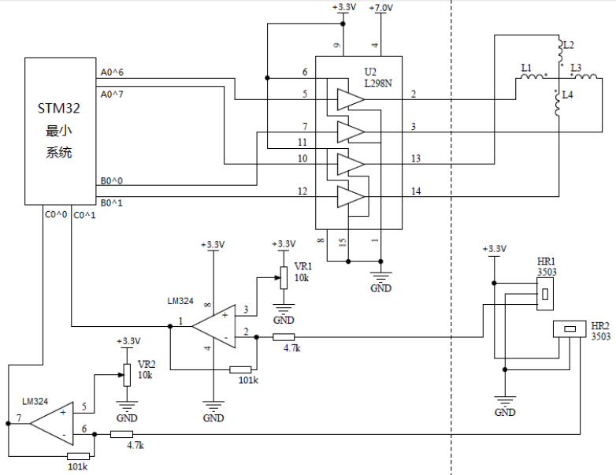

# FloatCup
简易磁悬浮控制装置项目，一道电子设计的题目。具体内容以后有空写
设计报告 [下载](https://raw.githubusercontent.com/talengu/FloatCup/master/doc/design_report.pdf)

>2014年的电子设计比赛的项目，我们用了三天三夜做出来的。还有很多要优化的地方。
在这谢谢，计算机学院的队友Wang，还有自动化工程学院的队友chen。

## 题目要求
制作一个简易下推式磁悬浮及其控制装置。 磁悬浮装置结构如下图所示 （左图为正
视，右俯中纸杯未画出）。环形磁铁 （左图为正视，右俯中纸杯未画出）。环形磁铁 A 位于
最下 方，用于提供主要磁力四个线圈 B 放在环形磁铁 放在环形磁铁 A 之上， 当四个线
圈通电后之上， 当四个线圈通电后产生磁力用于控制强铁 C，，使强磁铁 ，，使强磁铁 C
悬浮于空中，纸杯 D 粘贴在强磁铁 C 上，用于盛放物体霍尔传感器 上，用于盛放物体霍
尔传感器 上，用于盛放物体霍尔传感器 E 用于检测强磁铁 C 位置，返回信号用于控制线
位置，返回信号用于控制线圈电流。

## 硬件实现

## 软件实现

## 当时的文档
- 简易磁悬浮控制要求 [下载](https://raw.githubusercontent.com/talengu/FloatCup/master/doc/question.pdf)
- 设计报告 [下载](https://raw.githubusercontent.com/talengu/FloatCup/master/doc/design_report.pdf)
- stm32 Keil uVision4 的project [下载](https://raw.githubusercontent.com/talengu/FloatCup/master/doc/project_stm32_final_beta.rar)

## 串口工具
大家可能要用的串口工具，当时我们调PD参数用了很久。
- PL2303驱动，百度搜索下载2009版本的，windows自动下载的驱动可能不兼容。
- SerialChart一个串口读数据可视化的软件 
[教程](https://en.wikiversity.org/wiki/SerialChart_Tutorial)

## 版权说明
The MIT License Here.
